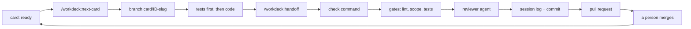

# WorkDeck

**Run a project as cards: one card per Claude Code session, with a scope gate, a separate review and one pull request.**

[](https://github.com/AshwinSathian/workdeck/actions/workflows/ci.yml)
[](https://github.com/AshwinSathian/workdeck/releases)
[](LICENSE)

WorkDeck is a plugin for [Claude Code](https://code.claude.com/docs/en/). A card is a small markdown file that describes one unit of work: what to read, which files may change, which tests must exist, and what must be true at the end. A session takes one card, implements it, passes your project's check command, gets a review from a separate agent, and opens one pull request. A person merges.

It suits a project where you review every pull request and want agent work in pieces small enough to review. The released version, 0.1, runs cards. You write them by hand, or use the quick lane, which writes a small one from a sentence. A planner that cuts a specification into cards is 0.2: it is built on the main branch and not yet released, and [Skills](#skills) says what it adds. A new install takes the main branch as it is, so until the release it receives the planner's skill and agent before they are released. What has been measured, and what has not, is in [`docs/evidence.md`](docs/evidence.md).

**Contents:** [What it looks like](#what-it-looks-like) · [Why](#why) · [How it compares](#how-it-compares) · [Install](#install) · [Quick start](#quick-start) · [The loop](#the-loop) · [A card](#a-card) · [Skills](#skills) · [The `card` command and configuration](#the-card-command-and-configuration) · [What the plugin runs](#what-the-plugin-runs) · [Requirements and limits](#requirements-and-limits) · [Evidence](#evidence) · [Known limits](#known-limits) · [When it stops](#when-it-stops) · [Upgrade](#upgrade) · [FAQ](#faq) · [Roadmap](#roadmap) · [How this was built](#how-this-was-built) · [Contributing](#contributing) · [License](#license)

## What it looks like

The commands and their output below are from [`examples/hello-deck/`](examples/hello-deck/), where you can reproduce them. The lines in parentheses describe what Claude does; they are not output.

```
$ card list
done     GREET-01     XS  Fix the greeting
ready    GREET-02     XS  Add a farewell

> /workdeck:next-card
  (Claude creates the branch card/GREET-02-add-a-farewell, reads the card,
   writes the test, then the code, and stops)
```

Suppose the session added the function without its test and edited a file the card does not list. The two gates say so:

```
$ card touched GREET-02
in Touch but not changed:
  tests/greet.sh
changed but not in Touch (revert it, or add it to Touch with a reason):
  test.sh

$ card tests GREET-02
no test with this name on one line of the files changed (nested names are not joined: use the innermost name, or edit the card line):
  farewell says goodbye with the name
```

Both exit 1, and handoff does not go on until they pass.

```
> /workdeck:handoff
  (Claude runs your check command and the gates, asks the reviewer agent,
   writes the session log, commits, pushes and opens the pull request)
```

[Pull request 1](https://github.com/AshwinSathian/workdeck/pull/1) in this repository was produced this way.

## Why

A long agent session fills its context window. Claude Code then compacts the conversation, and details from early in the session are lost. The diff also grows past what anyone will review carefully.

WorkDeck sizes work to fit one session. Each card has a size, each size has a budget for how much the session's context may grow, and the growth is measured from the session transcript and written into a log. The rules that a script can check are checked by a script: `card touched` fails if a file changed that the card does not list, and `card tests` fails if a test the card names does not exist. What a script cannot check goes to a reviewer agent that did not write the code.

## How it compares

These descriptions are from each project's README in October 2026.

- [Backlog.md](https://github.com/MrLesk/Backlog.md) recommends the same practice: one task, one agent session, one pull request. It gives you a task board and a command-line tool for it. WorkDeck enforces the practice. A gate fails when a file outside the card changes or a named test is missing, a hook stops a session that committed without a log, and each session's context growth is measured and recorded.
- [Spec Kit](https://github.com/github/spec-kit), [OpenSpec](https://github.com/Fission-AI/OpenSpec) and [BMAD](https://github.com/bmad-code-org/BMAD-METHOD) start earlier. They turn an idea into a specification and a plan. WorkDeck starts where they end, with work already cut into pieces, and 0.1 does not write the cards for you. The planner of 0.2, not yet released, writes them from a specification in one markdown file.
- [Superpowers](https://github.com/obra/superpowers) is a set of skills that the agent applies by itself during development. WorkDeck is two commands that you type, and its checks are scripts.
- [Taskmaster](https://github.com/eyaltoledano/claude-task-master) and [beads](https://github.com/gastownhall/beads) track tasks and their dependencies for agents, across several tools. WorkDeck works only in Claude Code, and its pull request step only on GitHub.

## Install

In Claude Code:

```
/plugin marketplace add AshwinSathian/workdeck
/plugin install workdeck@workdeck
```

The plugin puts `card` on the PATH of the commands Claude runs. Until 0.2 is released, a new install receives the main branch, which holds the unreleased planner; the `card` of the download line below is 0.1.3 and has no `plan` command. To use `card` yourself, or in CI, download the one file:

```
curl -fsSL https://raw.githubusercontent.com/AshwinSathian/workdeck/v0.1.3/bin/card -o card && chmod +x card
```

From 0.1.1, each [release](https://github.com/AshwinSathian/workdeck/releases) also carries `card` and `card.sha256`, so you can check the file with `shasum -a 256 -c card.sha256`.

## Quick start

In a git repository with at least one commit:

1. `/workdeck:init`. It finds your check command (for example `make check` or `npm test`) and your base branch, asks you to confirm both, and writes `workdeck.conf`, `cards/REVIEW.md`, a pull request template and a short section in `CLAUDE.md`. It shows you permission entries before adding them to `.claude/settings.json`. It also offers a CI workflow that runs `card lint` on pull requests, and to turn the plugin on for teammates in the project settings. Each teammate still installs it once.
2. Review what it wrote and **commit it on your base branch**. The next step stops if the working tree is dirty.
3. `/workdeck:quick "fix the typo in the greeting"`. Claude reads the relevant code, writes a small card, and shows it to you. Say yes, and it creates a branch, writes the test, and makes it pass.
4. `/workdeck:handoff`. Claude runs your check command, the gates and the reviewer, writes the session log, commits, pushes, and opens the pull request.
5. Merge the pull request.

The session needs permission to edit files: in a permission mode that refuses writes, the agent can read the card and do nothing else.

With no remote, handoff stops after the commit and tells you what is left. Merge the branch yourself and delete it. With no `gh`, it stops after the push and prints the URL for opening the pull request.

To plan more than one step ahead, write cards. `card new AUTH-03 "Token refresh" --size S` creates the file. Fill in its sections, then commit and push it on the base branch. `/workdeck:next-card` starts the first card that is ready.

In 0.2, `/workdeck:init` on a repository that already has `workdeck.conf` no longer stops. It offers four things and asks before each: the permission entries the settings file lacks, `touch_ignore` entries for tracked lockfiles and generated files, review rules taken from the project's own files, and the current text of the protocol section in `CLAUDE.md`, shown as a difference before it replaces yours. It does not offer the pull request template, the CI workflow or the settings for teammates there. A first run that was interrupted after `workdeck.conf` was written does not get them from a second run.

## The loop



You type the two skills and merge the pull request. The agent does the rest.

## A card

```markdown
---
id: AUTH-03
title: Token refresh
size: M
depends: AUTH-02
done: false
---

## Read
- docs/auth.md#refresh
- src/auth/session.ts

## Touch
- src/auth/refresh.ts (new)
- src/auth/refresh.test.ts (new)

## Tests
- refresh rotates the token
- expired refresh token is rejected

## Acceptance
- A refresh returns a new access token and invalidates the old refresh token.

## Out of scope
- Revoking sessions. AUTH-04 owns it.
```

- **Read** is what the agent reads before it plans. To read anything the card does not list, it first says why.
- **Touch** is the scope. Entries are shell patterns matched against the whole path: `src/auth/` covers the directory, `*.ts` matches at any depth, and a bare `refresh.ts` matches only at the repository root. `!` does not negate. Text after the first space is a comment.
- **Tests** names the tests that must exist. Write each line as the test will be named. `refresh rotates the token` is found in `test_refresh_rotates_the_token`, `TestRefreshRotatesTheToken` and `it('refresh rotates the token')`. A name split between a `describe` block and its `it`, or a class and its method, is not joined: use the innermost name.
- **Acceptance** is a list of statements that are true or false.
- **Out of scope** names work the card must not do. The reviewer looks for it in the diff.
- **Notes**, which `card new` also writes, is free text.
- **Blocked** is a section you or the agent add, with a question, when the card waits on a person. The card shows as `blocked` while the section is there.

The size is a budget for context growth. `card new` gives a card size S unless you say otherwise, and the quick lane writes XS cards. After a few cards, `card stats` shows what your sessions used at each size.

A full example with two cards, a session log and real output is in [`examples/hello-deck/`](examples/hello-deck/).

## Skills

| You type | What happens |
|---|---|
| `/workdeck:init` | Sets up a repository. Asks before each choice and commits nothing. In 0.2, on a repository that is already set up it offers what the repository lacks, where 0.1 stops |
| `/workdeck:plan <spec path> [what to change]` | 0.2: built on the main branch and not yet released. Cuts a specification, one markdown file committed in the repository, into an outline with one row per card. A script checks the outline, an agent that did not write it reviews it, and you approve it. It lands through a pull request that changes nothing else. Where the specification already has an outline, the run revises it |
| `/workdeck:next-card [id]` | Updates the base branch, picks the next ready card or the one you name, creates its branch and implements it. Stops before handoff. If one of your card pull requests has changes requested, it works on those first. In 0.2, when what it picks is a row of an outline, it first writes the card against the code as it is, shows it to you and waits for a yes, then commits that card alone |
| `/workdeck:quick "<description>"` | Writes an XS card from a sentence, shows it to you, then implements it |
| `/workdeck:handoff [split]` | Check, gates, review, session log, commit, push, pull request. `split` hands off the finished part and moves the rest to a new card. In 0.2, for a card written from a row, the pull request body shows the changes to the card since it was approved |

Claude cannot start these itself.

The plan session reads the specification, and it may push a `plan/*` branch and open a pull request. A specification from an untrusted source is an instruction to that session. Read a specification you did not write before you plan it.

A row is a card with no file yet. `card list` shows it with `[row]` after its title, and `card next` offers it when its dependencies are done. The card's body is written by the session that implements it, so it names files that exist at that moment. The outline format is in [`docs/reference.md`](docs/reference.md).

## The `card` command and configuration

`card` is one bash file. `card list` shows the deck, `card next` prints the first ready card, `card touched <id>` and `card tests <id>` are the two gates, and `card stats` reports context growth per card size. In 0.2, `card plan` checks the outlines. `card --help` lists every command.

`workdeck.conf` is `key = value` lines. It is parsed, never run. The only required key is `check`, the command that must pass before handoff.

Every command, the six card states, the outline format and every configuration key are in [`docs/reference.md`](docs/reference.md).

## What the plugin runs

Four hooks run while the plugin is enabled. In a repository with no `workdeck.conf`, each exits at once and prints nothing.

| Hook | What it does |
|---|---|
| Session start | Prints `card status` into the session |
| After each tool call | On a card branch, measures context growth. Past the card's budget it tells Claude, once, to finish the step and ask you to run `/workdeck:handoff split` |
| End of turn | On a card branch that has commits, a clean tree and no session log, stops Claude from ending the turn and tells it to ask you for handoff. In 0.2 a commit that changes only the cards directory does not count, so the commit of an approved card does not set it off |
| Before compaction | Leaves a marker so the session log records that the session compacted |

The after-tool-call hook costs about 2 ms per tool call when you are not on a card branch. On a card branch it reads the whole transcript each time: about 45 ms with a 2 MB transcript and 127 ms with a 20 MB one, measured on an Apple silicon Mac. See [`SECURITY.md`](SECURITY.md) for what the hooks and `card` trust.

## Requirements and limits

| | |
|---|---|
| Claude Code (CLI, desktop, IDE) | Yes. Built and run on 2.1.261 through 2.1.290; CI validates the manifests against the latest release |
| Claude Code on the web (cloud sessions) | No. Cloud sessions do not load a plugin that a repository's settings turn on |
| claude.ai and Cowork | No. They do not install a plugin that has a top-level `bin/` directory |
| Codex, Cursor, Gemini CLI and other agents | No. The hooks, skills and reviewer are Claude Code's. `card` itself runs anywhere bash does |
| macOS, Linux | Yes. `card` runs on bash 3.2 and later, with BSD or GNU tools |
| Windows | Not natively. Untested under WSL |
| Git host | Any, up to the pull request. Opening the pull request uses `gh`, so GitHub |
| Other tools | git, awk, sed, grep, sort (with `-V`) and the usual POSIX tools. `gh` is optional |

## Evidence

The main results, from [`docs/evidence.md`](docs/evidence.md):

- More than 300 shell tests run under bash 3.2 on macOS, and in CI on Ubuntu with `awk` as mawk and as gawk. `make test` runs them.
- One of this repository's own cards went through the whole loop against GitHub: [pull request 1](https://github.com/AshwinSathian/workdeck/pull/1). Its session grew by 25,982 tokens against an XS budget of 35,000 and did not compact.
- The same loop in a scratch repository, with only this plugin loaded, grew by 3,417 tokens, from 36,917 to 40,334.
- Installed from the marketplace into a new repository, init, quick and handoff produced a pull request. That session grew by 15,115 tokens.
- [`examples/hello-deck/`](examples/hello-deck/) shows both gates failing on a real change.

## Known limits

- The tests gate checks that a name is present. It does not check what the test asserts; the reviewer does. In a trial on sixteen test declarations in four languages it gave seven false failures, all on nested or reworded names, and two false passes. Each false failure costs one edit to the card line.
- The permission entries are not a sandbox. They match commands as written. Protect your base branch on the git host.
- The deny rules for a further argument after the branch name, such as `git push origin plan/* *`, do not match the plain push. Whether they refuse a push with a redirect after the branch name, `git push -u origin plan/<name> 2>&1`, has not been run.
- Some commands are not pre-approved: `git checkout`, `git pull`, `git add` and `git commit`. Claude asks before each, so an unattended next-card or handoff stops at the first one. A plan session in 0.2 uses those four and also `gh pr edit` and `rm`, which are not pre-approved either.
- In 0.2, `card plan` checks that every heading of the specification is planned, and it works at one heading level, chosen per outline. Text that sits under no heading at that level is outside the check. It is a net for a section nobody planned, not a count of requirements; the plan reviewer reads for those.
- Only `#` headings count. A heading underlined with `=` or `-` is not seen. Two headings with the same letters and digits count as one.
- `card plan` is not a handoff gate. A fault in an outline does not make a card's work wrong, so it does not stop a handoff. It does stop `/workdeck:next-card` from writing the card for a row of that outline. CI, if you add the step, and the next plan run report it.
- `card plan check` is true when it runs, before you approve a card written from a row. No gate runs it again.
- Token measurement reads the session transcript, which is not a documented format. If it changes, `card tokens` prints `unknown` and nothing else breaks. Subagent turns are not counted, so the reviewer's tokens are in no figure here.
- A resumed session keeps its transcript, so its baseline is the first turn of the original session and growth is counted from there.
- A budget is a warning. It does not stop the model.
- `review` needs `--fetch`. Without it a card with an open pull request shows as `active`.
- A path with a space cannot be written in `Touch` as it is, because text after the first space is a comment. Use `?` for the space: `src/my?file.ts`.
- A file whose name git quotes (one containing a double quote) cannot be listed in `Touch`.
- Title length is counted in bytes, so a title with non-ASCII characters gets fewer than 80.
- If another program named `card` is already on your PATH, Claude runs that one: Claude Code puts a plugin's `bin/` directory after your own PATH entries.
- Claude Code keeps an installed plugin at the version in its manifest. A fix reaches you only with a new version; see [Upgrade](#upgrade).

## When it stops

- **next-card or quick stops on a dirty tree.** Commit or stash first. Right after init, this means committing what init wrote.
- **The pull is not a fast-forward.** Your local base branch has commits the remote does not. Push them, or land them through a pull request.
- **`card lint` fails on a new card.** `card new` writes empty sections. Fill in `Touch`, `Tests` and `Acceptance`.
- **"No card is ready" and a card shows `active`.** A branch named `card/<id>` or `card/<id>-<slug>` holds it. Delete the branch to release the card.
- **A card with an open pull request shows `active`.** Use `--fetch`, with `gh` signed in.
- **Claude will not end its turn.** A card branch has commits and no session log. In 0.2 the commits must change something outside the cards directory. Run `/workdeck:handoff`.
- **Token fields say `unknown`.** The session started without the plugin enabled, or the transcript format changed.

## Upgrade

Claude Code does not update a plugin from this marketplace by itself. From a shell:

```
claude plugin marketplace update workdeck
claude plugin update workdeck@workdeck
```

Restart Claude Code afterwards. If you downloaded `card` with `curl`, or use the CI workflow, change the tag in the URL. [`CHANGELOG.md`](CHANGELOG.md) says what each version changed.

## FAQ

**Context windows keep growing. Does sizing still matter?** Less, for compaction. Budgets are configuration, so raise them. The scope gate, the review by a separate agent, the pull request per card and the measured record do not depend on window size.

**What does it cost in context?** In every session, the descriptions of the two agents: the reviewer and, in 0.2, the plan reviewer. Claude cannot start a WorkDeck skill itself, and such a skill adds nothing to a session until you type it. `claude plugin details workdeck` projects about 340 tokens without the planner and about 470 with it, but that projection counts the skills. Measured once, the first turn of a session was 83 tokens larger with the plan skill and the plan reviewer than without them; the record is in [`docs/development/spike-0.2.md`](docs/development/spike-0.2.md). A skill's full text loads only when you run it: in 0.1.1, about 810 tokens for quick and 1,200 to 1,400 for each of the others, and about 880 for the reviewer. The skills that 0.2 adds or changes have not been measured. The hooks add nothing until they print. In a WorkDeck project the session-start hook adds the `card status` lines.

**I set up my repository with 0.1. What do I do to plan?** Once 0.2 is released, update the plugin and run `/workdeck:init` again. It offers the permission entries for `plan/*` branches, and the current protocol section, which has two new lines. It asks before each. A yes to the second replaces the whole section, with any change you made to it, after showing you the difference. Nothing else has to change: a 0.1 repository that does not use the planner works as before.

**How do I run `card plan` in CI?** Once 0.2 is released, change the tag in the workflow and add the step that runs `card plan`. A workflow pinned to `card` 0.1.3 keeps passing on a planned deck, because `card lint` does not read outlines.

**Why bash?** So `card` is one file with nothing to install, which CI can fetch with `curl`. The cost is no native Windows. A single binary with the same commands would remove that limit. It is not built.

**Why do I have to type handoff?** It pushes a branch and opens a pull request, so a person starts it.

**How do I stop using it?** Run `claude plugin uninstall workdeck@workdeck`, then `claude plugin marketplace remove workdeck`; the hooks go with the plugin. Remove the WorkDeck section from `CLAUDE.md` and the entries init added to `.claude/settings.json`. `cards/`, `log/` and `workdeck.conf` are plain files.

## Roadmap

- **0.2**: a planner that writes cards from a specification, and init for a repository that is already set up. It is built on the main branch and not yet released. How planned cards hold up has not been measured. The design is [`docs/design-0.2.md`](docs/design-0.2.md).
- **0.3**: claiming cards, worktrees and parallel sessions. The file formats already allow it. Not built.

To ask for something or argue against one of these, [open an issue](https://github.com/AshwinSathian/workdeck/issues).

## How this was built

A coding agent built it under supervision, from a written design, and the records are in this repository. The order was: a [design](docs/design.md), an adversarial review of it, a [plan](docs/development/plan-0.1.md), then the code, test first. Once `card` could run cards, the rest of the work became cards in [`cards/`](cards/), each done on its own branch, through the gates, with a log in [`log/`](log/).

Those cards were driven by hand in one long session, without the plugin loaded, so their logs say `unknown` for the token fields. One card, the license, was run by the maintainer through `/workdeck:next-card` and `/workdeck:handoff`, and merged as [pull request 1](https://github.com/AshwinSathian/workdeck/pull/1). Of the 24 session logs for 0.1, its log is the only one with measured figures. What went wrong along the way, including three independent reviews and what they overturned, is in [`docs/development/findings.md`](docs/development/findings.md).

## Contributing

See [`CONTRIBUTING.md`](CONTRIBUTING.md) and the [code of conduct](CODE_OF_CONDUCT.md). `make test` and `make lint` are the two commands to know.

## License

[MIT](LICENSE).
