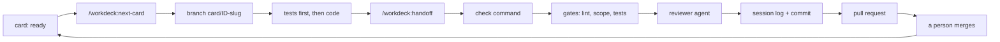

# Workdeck

**Run a project as a deck of cards: one card per Claude Code session, one pull request per card.**

[](https://github.com/AshwinSathian/workdeck/actions/workflows/ci.yml)
[](LICENSE)

Workdeck is a plugin for [Claude Code](https://code.claude.com/docs/en/). A card is a small markdown file that describes one unit of work: what to read, which files may change, which tests must exist, and what must be true at the end. A session takes one card, implements it, passes your project's check command, gets a review from a separate agent, and opens one pull request. A person merges.

## Why

A long agent session fills its context window. Claude Code then compacts the conversation, and details from early in the session are lost. The diff also grows past what anyone will review carefully.

Workdeck sizes work to fit one session. Each card has a size, each size has a budget for how much the session's context may grow, and the growth is measured from the session transcript and written into a log. The rules that a script can check are checked by a script: `card touched` fails if a file changed that the card does not list, and `card tests` fails if a test the card names does not exist. What a script cannot check goes to a reviewer agent that did not write the code.

## The loop



You type the two skills. Everything between them is the agent working on one card.

## Requirements and limits

| | |
|---|---|
| Claude Code (CLI, desktop, IDE) | Yes. Built and tested on 2.1.261 |
| claude.ai and Cowork | No. They do not install a plugin that has a top-level `bin/` directory |
| macOS, Linux | Yes. `card` runs on bash 3.2 and later, with BSD or GNU tools |
| Windows | Not natively. Untested under WSL |
| Git host | Any, up to the pull request. Opening the pull request uses `gh`, so GitHub |
| Other tools | git, awk, sed, grep, sort. `gh` is optional |

Workdeck 0.1 runs cards. It does not write them for you from a specification; that is planned for 0.2. You write cards by hand, or use the quick lane, which writes a small one from a sentence.

## Install

In Claude Code:

```
/plugin marketplace add AshwinSathian/workdeck
/plugin install workdeck@workdeck
```

The plugin puts `card` on the PATH of the commands Claude runs. To use `card` yourself, or in CI, download the one file:

```
curl -fsSL https://raw.githubusercontent.com/AshwinSathian/workdeck/v0.1.0/bin/card -o card && chmod +x card
```

## Quick start

In a git repository with at least one commit:

1. `/workdeck:init`. It finds your check command (for example `make check` or `npm test`) and your base branch, asks you to confirm both, and writes `workdeck.conf`, `cards/REVIEW.md`, a pull request template and a short section in `CLAUDE.md`. It shows you permission entries before adding them to `.claude/settings.json`.
2. Review what it wrote and **commit it on your base branch**. The next step stops if the working tree is dirty.
3. `/workdeck:quick "fix the typo in the greeting"`. Claude reads the relevant code, writes a small card, and shows it to you. Say yes, and it creates a branch, writes the test, and makes it pass.
4. `/workdeck:handoff`. Claude runs your check command, the gates and the reviewer, writes the session log, commits, pushes, and opens the pull request.
5. Merge the pull request.

With no remote, handoff stops after the commit and tells you what is left. Merge the branch yourself and delete it. With no `gh`, it stops after the push and prints the URL for opening the pull request.

To plan more than one step ahead, write cards: `card new AUTH-03 "Token refresh" --size S` creates the file, you fill in its sections, commit and push it on the base branch, and `/workdeck:next-card` starts the first card that is ready.

## A card

```markdown
---
id: AUTH-03
title: Token refresh
size: M
depends: AUTH-02
done: false
---

## Read
- docs/auth.md#refresh
- src/auth/session.ts

## Touch
- src/auth/refresh.ts (new)
- src/auth/refresh.test.ts (new)

## Tests
- refresh rotates the token
- expired refresh token is rejected

## Acceptance
- A refresh returns a new access token and invalidates the old refresh token.

## Out of scope
- Revoking sessions. AUTH-04 owns it.
```

- **Read** is what the agent reads before it plans. It says why before reading anything else.
- **Touch** is the scope. Entries are shell patterns matched against the whole path: `src/auth/` covers the directory, `*.ts` matches at any depth, and a bare `refresh.ts` matches only at the repository root. `!` does not negate. Text after the first space is a comment.
- **Tests** names the tests that must exist. Write each line as the test will be named. `refresh rotates the token` is found in `test_refresh_rotates_the_token`, `TestRefreshRotatesTheToken` and `it('refresh rotates the token')`. A name split between a `describe` block and its `it`, or a class and its method, is not joined: use the innermost name.
- **Acceptance** is a list of statements that are true or false.

A full example with two cards, a session log and real output is in [`examples/hello-deck/`](examples/hello-deck/).

## Skills

| You type | What happens |
|---|---|
| `/workdeck:init` | Sets up a repository. Asks before each choice and commits nothing |
| `/workdeck:next-card [id]` | Updates the base branch, picks the next ready card or the one you name, creates its branch and implements it. Stops before handoff |
| `/workdeck:quick "<description>"` | Writes an XS card from a sentence, shows it to you, then implements it |
| `/workdeck:handoff [split]` | Check, gates, review, session log, commit, push, pull request. `split` hands off the finished part and moves the rest to a new card |

Claude cannot start these itself. Handoff pushes a branch and opens a pull request, so a person starts it.

## The `card` command

```
card next [--fetch]            print the first ready card
card show <id>                 print one card
card list [--fetch]            one line per card: state, id, size, title
card status [--fetch]          current card, open work, next ready card
card new <id> <title> [--size XS|S|M] [--depends ID,ID]
card done <id>                 set done: true in the card file
card lint                      check every card and log file
card touched <id>              scope gate: changed files against the Touch list
card tests <id>                tests gate: each Tests line names a test that exists
card tokens [transcript]       baseline, peak and growth for a session
card log-new <id> <outcome>    create a session log entry
card stats                     growth per card size across session logs
card conf <key>                print one configuration value
```

`--fetch` runs `git fetch --prune` and reads open pull requests with `gh`; nothing else in `card` uses the network. Reports go to stdout and errors to stderr. Exit codes: 0 ok, 1 a check failed or nothing matched, 2 usage or configuration error.

### Card states

`card` works out each card's state when asked. Only `done` is stored in the file.

| State | Means |
|---|---|
| `done` | `done: true` on the base branch, local or remote |
| `review` | an open pull request from the card's branch (needs `--fetch`) |
| `blocked` | the card's branch exists and the card has a `## Blocked` section |
| `active` | the card's branch exists |
| `ready` | no branch, and every dependency is done |
| `waiting` | no branch, and a dependency is not done |

A card's branch is `card/<id>` or `card/<id>-<slug>`. Deleting the branch releases the card.

## Configuration

`workdeck.conf` is `key = value` lines. It is parsed, never run.

| Key | Default | Meaning |
|---|---|---|
| `version` | `1` | Format version of the config, card and log files |
| `check` | required | Command that must pass before handoff |
| `base` | `main` | Branch that cards start from and pull requests target |
| `cards_dir` | `cards` | Where card files are |
| `log_dir` | `log` | Where session logs are |
| `budget.XS` | `35000` | Context growth, in tokens, allowed for an XS card |
| `budget.S` | `70000` | The same for S |
| `budget.M` | `100000` | The same for M |
| `touch_ignore` | empty | Comma-separated patterns the scope gate ignores, such as lockfiles |
| `status_max_chars` | `6000` | Cap on the status text shown at session start |
| `reviewer` | `on` | `off` skips the reviewer for XS cards only |

Add a size by adding a budget: `budget.L = 150000`.

A budget limits growth: the largest context size in the session minus its size at the first turn. The first turn already holds the system prompt, tool definitions and plugins, and that differs between machines, so an absolute limit would mean something different for everyone. `card stats` shows the growth your own sessions had, per size, so you can set budgets from your own numbers.

## What the plugin runs

Four hooks run while the plugin is enabled. In a repository with no `workdeck.conf`, each exits at once and prints nothing.

| Hook | What it does |
|---|---|
| Session start | Prints `card status` into the session |
| After each tool call | On a card branch, measures context growth. Past the card's budget it tells Claude, once, to finish the step and ask you to run `/workdeck:handoff split` |
| End of turn | On a card branch that has commits and no session log, stops Claude from finishing once and tells it to ask you for handoff |
| Before compaction | Leaves a marker so the session log records that the session compacted |

The after-tool-call hook costs about 2 ms per tool call when you are not on a card branch and about 45 ms when you are. See [`SECURITY.md`](SECURITY.md) for what the hooks and `card` trust.

## Evidence

[`docs/evidence.md`](docs/evidence.md) lists what has been measured and what has not. In short:

- More than 300 shell tests run under bash 3.2 on macOS, and in CI on Ubuntu with `awk` as mawk and as gawk. `make test` runs them.
- One card run through the full loop in a scratch repository grew its session's context by 3,417 tokens, from 36,917 to 40,334, against an XS budget of 35,000.
- [`examples/hello-deck/`](examples/hello-deck/) shows both gates failing on a real change.

## Known limits

- **The tests gate checks that a name is present.** It does not check what the test asserts; the reviewer does. In a trial on sixteen test declarations in four languages it gave seven false failures, all on nested or reworded names, and two false passes. Each false failure costs one edit to the card line.
- **The permission entries are not a sandbox.** They match commands as written. Protect your base branch on the git host.
- **`git commit` is not pre-approved**, so Claude asks before the handoff commit. An unattended handoff stops there.
- **Token measurement reads the session transcript**, which is not a documented format. If it changes, `card tokens` prints `unknown` and nothing else breaks. Subagent turns are not counted.
- **A budget is a warning.** It does not stop the model.
- **`review` needs `--fetch`.** Without it a card with an open pull request shows as `active`.
- A file whose name git quotes (one containing a double quote) cannot be listed in `Touch`.
- Title length is counted in bytes, so a title with non-ASCII characters gets fewer than 80.
- Claude Code keeps an installed plugin at the version in its manifest. A fix reaches you only with a new version.

## FAQ

**Context windows keep growing. Does sizing still matter?** Less, for compaction. Budgets are configuration, so raise them. The scope gate, the review by a separate agent, the pull request per card and the measured record do not depend on window size.

**Why bash?** So `card` is one file with nothing to install, which CI can fetch with `curl`. The cost is no native Windows. A single binary with the same commands is the way out if that matters.

**Why do I have to type handoff?** It pushes and opens a pull request. Those are yours to start.

**How do I stop using it?** Disable or uninstall the plugin; the hooks go with it. Remove the Workdeck section from `CLAUDE.md` and the entries init added to `.claude/settings.json`. `cards/`, `log/` and `workdeck.conf` are plain files.

## Roadmap

- **0.2**: a planner that writes cards from a specification, and onboarding for an existing codebase. Not built.
- **0.3**: claiming cards, worktrees and parallel sessions. The file formats already allow it. Not built.

## How this was built

By a coding agent under supervision, from a written design, in the open. The order was: a [design](docs/design.md), an adversarial review of it, a [plan](docs/development/plan-0.1.md), then the code, test first. Once `card` could run cards, the rest of the work became cards in [`cards/`](cards/), each done on its own branch, through the gates, with a log in [`log/`](log/).

Those cards were driven by hand in one long session, without the plugin loaded, so their logs say `unknown` for the token fields. The skills, hooks and reviewer were run end to end in a scratch repository. What went wrong along the way, including three independent reviews and what they overturned, is in [`docs/development/findings.md`](docs/development/findings.md).

## Contributing

See [`CONTRIBUTING.md`](CONTRIBUTING.md). `make test` and `make lint` are the two commands to know.

## License

[MIT](LICENSE).

Workdeck is not affiliated with the Workdeck product at workdeck.com.
